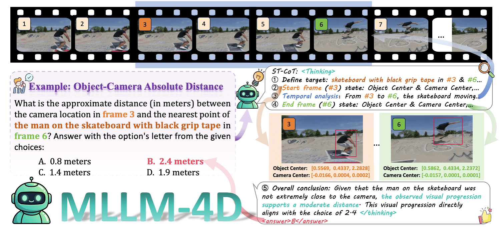

## MLLM-4D: Towards Visual-based Spatial-Temporal Intelligence

#### [Xingyilang Yin](https://flow0314.github.io/)<sup>1,2</sup>, [Chengzhengxu Li](https://scholar.google.com/citations?user=NSWsjzcAAAAJ&hl=zh-CN)<sup>3</sup>, [Jiahao Chang](https://github.com/Jiahao620)<sup>4</sup>, [Chi-Man Pun](https://cmpun.github.io/)<sup>1,📫</sup>, [Xiaodong Cun](https://vinthony.github.io/academic/)<sup>2,📫</sup>

ArXiv | PDF | [Model](https://huggingface.co/flow666/MLLM-4D/tree/main) | Dataset

###### <sup>1</sup> University of Macau, <sup>2</sup> GVC Lab, Great Bay University, <sup>3</sup> Xi’an Jiaotong University, <sup>4</sup> CUHK-SZ

>TL;DR: MLLM-4D achieves advanced visual-based spatial-temporal intelligence via the post-training of the vision language model (VLM). Our method specifically focuses on understanding the dynamic relationships between objects and the camera.



## ⚙️ Setup

### 1. Clone MLLM-4D
```bash
git clone https://github.com/GVCLab/MLLM-4D.git
cd MLLM-4D
```
### 2. Setup environments
MLLM-4D is tested with CUDA 12.1/12.8 on H100.
```bash
conda create -n mllm4d python=3.10
conda activate mllm4d 
pip install torch==2.8.0 torchvision==0.23.0 torchaudio==2.8.0 --index-url https://download.pytorch.org/whl/cu128
pip install -r requirements.txt
wget https://github.com/Dao-AILab/flash-attention/releases/download/v2.8.3/flash_attn-2.8.3+cu12torch2.8cxx11abiFALSE-cp310-cp310-linux_x86_64.whl
pip install flash_attn-2.8.3+cu12torch2.8cxx11abiFALSE-cp310-cp310-linux_x86_64.whl
```

### 3. Download pretrained models
```bash
python scripts/download_ckpt_hf.py
```

<!-- ### 4. Download the datasets
```bash
``` -->

## 💫 Inference 
### 1. Inference Demo
```bash
# for MLLM-4D-SFT
python scripts/inference.py --model_type "MLLM-4D-SFT" --model_path PATH-to-MLLM-4D-SFT
# for MLLM-4D-RFT
python scripts/inference.py --model_type "MLLM-4D-RFT" --model_path PATH-to-MLLM-4D-RFT
```

## 📋 TODO
- [ ] We have completed the code and data cleanup. Release coming soon!
- [ ] RFT Stage: Release the `MLLM4D-R1-30k` dataset and `Reinforcement Fine-Tuning code`!
- [ ] Cold-Start Phase: Release the `Cold-Start Data` and `Cold-Start Fine-Tuning code`!
- [ ] SFT Stage: Release the `MLLM4D-2M` dataset and `Supervised Fine-Tuning code`!
- [x] **[2026.02.28]** 🔥 Release the `arXiv paper`, `inference demo`, and `pretrained weights`!

## 🤗 Acknowledgement
Our work is built upon [Qwen3-VL](https://github.com/QwenLM/Qwen3-VL), thanks to their invaluable contributions
🤗 If you find MLLM-4D useful, **please help ⭐ this repo**, which is important to Open-Source projects. Thanks!

## 📜 Citation
If you find the work useful, please consider citing:
```BibTeXw

```
